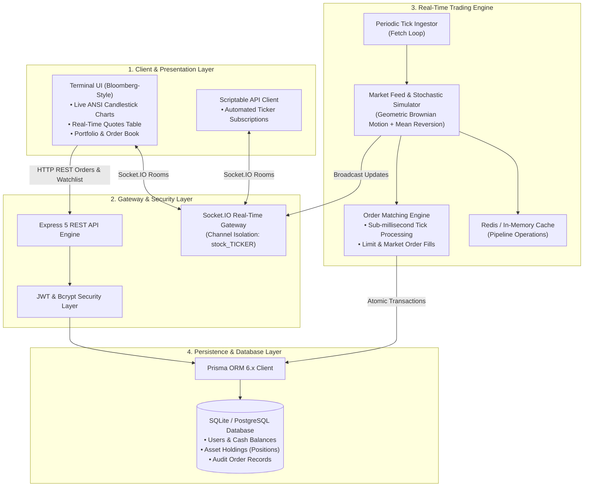
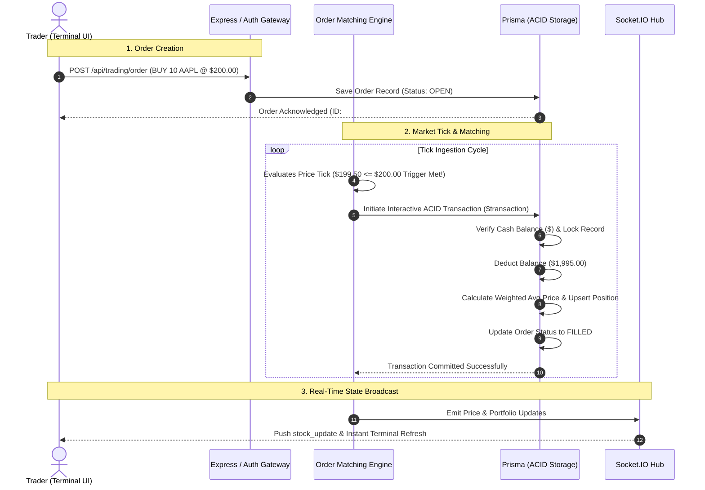

# ⚡ CashFlo Terminal: Real-Time Trading Engine & Market Platform

[](https://nodejs.org/)
[](https://expressjs.com/)
[](https://socket.io/)
[](https://www.prisma.io/)
[](https://sqlite.org/)
[](https://redis.io/)
[](LICENSE)

> **CashFlo Terminal** is a high-performance, event-driven trading simulator and real-time market data platform. It features an in-memory limit and market order execution engine, ACID-compliant transactional portfolio management, a stochastic market data simulator, a multi-room WebSocket broadcasting layer, and an interactive Bloomberg-style Terminal User Interface (TUI).

---

## 📌 Table of Contents
- [Key Features & Engineering Highlights](#-key-features--engineering-highlights)
- [System Architecture](#-system-architecture)
- [Trade Lifecycle & Execution Flow](#-trade-lifecycle--execution-flow)
- [Terminal User Interface (TUI)](#-terminal-user-interface-tui)
- [Tech Stack](#-tech-stack)
- [API & WebSocket Protocol](#-api--websocket-protocol)
- [Getting Started](#-getting-started)
- [Project Structure](#-project-structure)

---

## 🌟 Key Features & Engineering Highlights

* ⚡ **Event-Driven Matching Engine:** Evaluates queued `MARKET` and `LIMIT` orders against incoming real-time price ticks with sub-millisecond execution latency.
* 🔒 **ACID Transactional Portfolio Management:** Leverages Prisma interactive transactions (`prisma.$transaction`) to guarantee atomic balance deductions, position updates, and weighted-average price calculations with zero race conditions or double-spending.
* 🎲 **Stochastic Market Simulator:** Built-in **Geometric Brownian Motion (GBM)** generator with Ornstein-Uhlenbeck mean-reversion drift to produce continuous, realistic market ticks without hitting external API rate limits (HTTP 429).
* 📡 **Room-Isolated WebSocket Streaming:** Partitions high-frequency price feeds into discrete ticker channels (`stock_{TICKER}`) via Socket.IO, eliminating global network broadcast storms.
* 📊 **Terminal Candlestick Visualization:** Real-time Open-High-Low-Close (OHLC) financial candlestick charts synthesized on the fly from scalar tick streams and rendered directly in ASCII.
* 🛡️ **End-to-End Stateless Security:** JWT token authentication enforced across both HTTP REST endpoints and WebSocket TCP connection handshakes.

---

## 🏗️ System Architecture


```mermaid
flowchart TB
    subgraph ClientLayer ["1. Client & Presentation Layer"]
        TUI["Terminal UI (Bloomberg-Style)\n• Live ANSI Candlestick Charts\n• Real-Time Quotes Table\n• Portfolio & Order Book"]
        CLI["Scriptable API Client\n• Automated Ticker Subscriptions"]
    end

    subgraph GatewayLayer ["2. Gateway & Security Layer"]
        Express["Express 5 REST API Engine"]
        JWTAuth["JWT & Bcrypt Security Layer"]
        SocketHub["Socket.IO Real-Time Gateway\n(Channel Isolation: stock_TICKER)"]
    end

    subgraph CoreEngine ["3. Real-Time Trading Engine"]
        Scheduler["Periodic Tick Ingestor\n(Fetch Loop)"]
        Simulator["Market Feed & Stochastic Simulator\n(Geometric Brownian Motion + Mean Reversion)"]
        MatchingEngine["Order Matching Engine\n• Sub-millisecond Tick Processing\n• Limit & Market Order Fills"]
        CacheLayer["Redis / In-Memory Cache\n(Pipeline Operations)"]
    end

    subgraph DataLayer ["4. Persistence & Database Layer"]
        Prisma["Prisma ORM 6.x Client"]
        Database[("SQLite / PostgreSQL Database\n• Users & Cash Balances\n• Asset Holdings (Positions)\n• Audit Order Records")]
    end

    TUI -->|HTTP REST Orders & Watchlist| Express
    TUI <-->|Socket.IO Rooms| SocketHub
    CLI <-->|Socket.IO Rooms| SocketHub

    Express --> JWTAuth
    JWTAuth --> Prisma

    Scheduler --> Simulator
    Simulator --> CacheLayer
    Simulator --> MatchingEngine
    Simulator -->|Broadcast Updates| SocketHub

    MatchingEngine -->|Atomic Transactions| Prisma
    Prisma --> Database
```

---

## ⚡ Trade Lifecycle & Execution Flow


```mermaid
sequenceDiagram
    autonumber
    actor Trader as Trader (Terminal UI)
    participant Gateway as Express / Auth Gateway
    participant Engine as Order Matching Engine
    participant DB as Prisma (ACID Storage)
    participant WS as Socket.IO Hub

    Note over Trader,Gateway: 1. Order Creation
    Trader->>Gateway: POST /api/trading/order (BUY 10 AAPL @ $200.00)
    Gateway->>DB: Save Order Record (Status: OPEN)
    DB-->>Trader: Order Acknowledged (ID: #101, Status: OPEN)

    Note over Engine,DB: 2. Market Tick & Matching
    loop Tick Ingestion Cycle
        Engine->>Engine: Evaluates Price Tick ($199.50 <= $200.00 Trigger Met!)
        Engine->>DB: Initiate Interactive ACID Transaction ($transaction)
        DB->>DB: Verify Cash Balance ($) & Lock Record
        DB->>DB: Deduct Balance ($1,995.00)
        DB->>DB: Calculate Weighted Avg Price & Upsert Position
        DB->>DB: Update Order Status to FILLED
        DB-->>Engine: Transaction Committed Successfully
    end

    Note over WS,Trader: 3. Real-Time State Broadcast
    Engine->>WS: Emit Price & Portfolio Updates
    WS-->>Trader: Push stock_update & Instant Terminal Refresh
```

---

## 🖥️ Terminal User Interface (TUI)

The Bloomberg-style terminal dashboard is structured across a responsive 12x12 ANSI grid layout:

```
┌────────────────────────────────────────────────────────────────────────┐
│  C A S H F L O   T E R M I N A L  |  Trade the Flow, Master the Market │
├──────────────────────────────────────┬─────────────────────────────────┤
│  [ LIVE CANDLESTICK CHART ]          │ [ LIVE QUOTES TABLE ]           │
│  Shows real-time price trend bars    │ Sym   Price    Change   Volume  │
│  for the active selected stock       │ AAPL  $215.30  +1.45    3.2M    │
│  (e.g., Apple, Tesla, Google)        │ TSLA  $248.10  -2.10    8.1M    │
├──────────────────────────────────────┼─────────────────────────────────┤
│  [ USER PORTFOLIO ]                  │ [ EVENT LOG ]                   │
│  Cash Balance: $98,450.00            │ [14:02] Connected to server     │
│  AAPL: 10 shares @ $210.00           │ [14:03] Order FILLED: BUY 10 AAP│
│  Open Orders: BUY 5 TSLA @ $240      │ [14:04] Switched chart to TSLA  │
├──────────────────────────────────────┴─────────────────────────────────┤
│  [ COMMAND BAR ]: buy AAPL 10 200.00                                   │
└────────────────────────────────────────────────────────────────────────┘
```

### ⌨️ Interactive Terminal Commands

| Command | Syntax | Description | Example |
| :--- | :--- | :--- | :--- |
| **`BUY`** | `buy <TICKER> <QTY> [PRICE]` | Submits a Market or Limit Buy order | `buy AAPL 10 200.50` |
| **`SELL`** | `sell <TICKER> <QTY> [PRICE]` | Submits a Market or Limit Sell order | `sell GOOG 5` |
| **`WATCH`** | `watch <TICKER>` | Subscribes to live ticks and updates chart | `watch TSLA` |
| **`CHART`** | `chart <TICKER>` | Switches visual candlestick focus to ticker | `chart NVDA` |
| **`HELP`** | `help` | Displays command usage inside the Event Log | `help` |

---

## 🛠️ Tech Stack

| Layer | Technologies | Role & Purpose |
| :--- | :--- | :--- |
| **Runtime & Backend** | **Node.js (ESM), Express 5** | High-throughput asynchronous runtime powering the REST API and tick scheduler. |
| **Real-Time WebSockets** | **Socket.IO 4.x** | Persistent full-duplex communication with channel-isolated room subscriptions. |
| **Database & ORM** | **Prisma ORM 6.x, SQLite / PostgreSQL** | Type-safe schema definitions and interactive ACID transactions. |
| **Caching Layer** | **Redis / In-Memory Mock Pipeline** | Low-latency key-value caching (5-min TTL) for fast stock quote queries. |
| **Terminal Frontend** | **Blessed, Blessed-Contrib, Candlestick-CLI** | Low-overhead ANSI grid rendering with hardware-efficient smart CSR redraws. |
| **Security & Auth** | **JWT, Bcrypt.js** | Stateless token-based authentication across REST and WebSocket handshakes. |

---

## 📡 API & WebSocket Protocol

### REST Endpoints

| Method | Endpoint | Auth | Description |
| :--- | :--- | :--- | :--- |
| `POST` | `/api/auth/register` | Public | Register a new trading account. |
| `POST` | `/api/auth/login` | Public | Authenticate user and obtain JWT token. |
| `GET` | `/api/stocks/watchlist` | Bearer Token | Retrieve user's monitored stock symbols. |
| `POST` | `/api/stocks/watchlist` | Bearer Token | Add ticker symbols to watchlist. |
| `DELETE`| `/api/stocks/watchlist` | Bearer Token | Remove ticker symbols from watchlist. |
| `GET` | `/api/trading/portfolio` | Bearer Token | Fetch cash balance, active positions, and open orders. |
| `POST` | `/api/trading/order` | Bearer Token | Submit a new `MARKET` or `LIMIT` order. |
| `GET` | `/health` | Public | System health check (DB connection & Redis status). |

### WebSocket Events

| Event Name | Emitter | Payload | Description |
| :--- | :--- | :--- | :--- |
| `subscribe` | Client $\to$ Server | `string[]` (e.g. `["AAPL", "NVDA"]`) | Joins client socket to specified ticker rooms. |
| `unsubscribe` | Client $\to$ Server | `string[]` | Leaves client socket from specified ticker rooms. |
| `stock_update`| Server $\to$ Client | `{ [ticker]: StockData }` | Pushes live price, volume, and percentage change ticks. |

---

## 🚀 Getting Started

### Prerequisites
* **Node.js** (v18.0.0 or higher)
* **npm** (v9.0.0 or higher)

---

### 1-Click Launch (Windows)
Double-click `start.bat` in the root directory, or run from PowerShell:
```powershell
.\start.bat
```
*This launches the backend in a background window, runs database migrations, and boots the interactive Terminal UI in your current shell.*

---

### Manual Launch

#### 1. Start Backend Server
```bash
cd cashflo-backend
npm install
npx prisma db push
npm run dev
```

#### 2. Launch Terminal UI Dashboard
```bash
cd cashflo-ws
npm install
npm run dashboard
```

---

## 📁 Project Structure

```
trading-backend/
├── assets/                          # Architecture diagrams & media assets
│   └── architecture-diagram-cashflo.png
├── cashflo-backend/                 # Core backend API & trading engine
│   ├── prisma/
│   │   ├── schema.prisma            # Prisma schema (User, Order, Position, Watchlist)
│   │   └── dev.db                   # SQLite database
│   └── src/
│       ├── config/                  # Database & Redis configuration
│       ├── controllers/             # Auth, Stock, and Trading controllers
│       ├── middleware/              # JWT authorization middleware
│       ├── routes/                  # REST API route definitions
│       ├── services/                # TradingEngine, TickerService, WebSocketService
│       └── server.js                # Express & Socket.IO server entry point
├── cashflo-ws/                      # Interactive Terminal Client
│   ├── dashboard.js                 # Blessed/Blessed-Contrib Terminal UI
│   └── client.js                    # Headless scriptable WebSocket test client
├── docker-compose.yml               # Optional PostgreSQL & Redis container setup
├── start.bat                        # Automated 1-click launcher script
└── README.md
```

---

## 📄 License
This project is open-source and licensed under the [ISC License](LICENSE).
